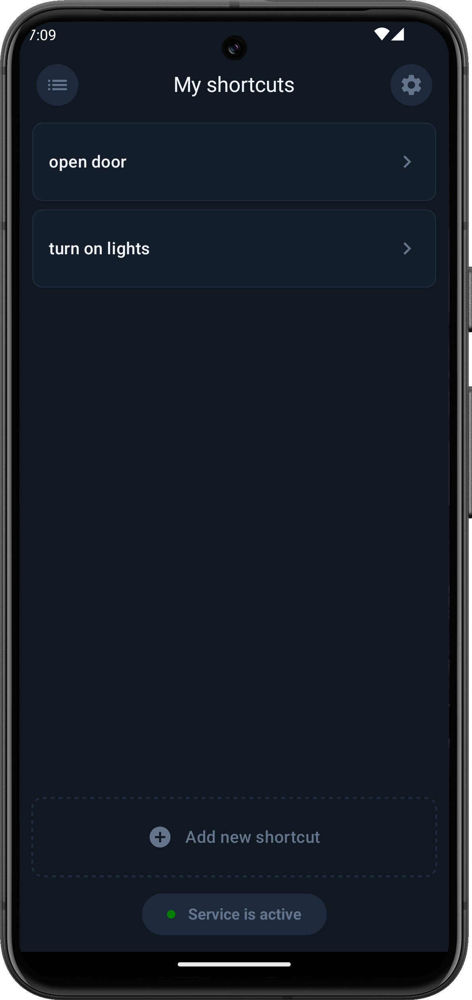
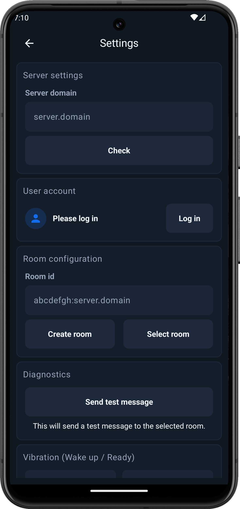

<h1>
	
	Matrix Shortcut
</h1>

This app is a small tool that lets you send messages to a Matrix server using preconfigured gestures. Gestures are triggered exclusively via physical buttons (volume up and down), allowing them to be performed even while the phone is in your pocket. For example, you could trigger actions like unlocking your door or turning on lights as you approach home.

	
	
	

### 📝 Features
- Configure a Matrix server connection
- Add, edit, and remove shortcuts
- Import and export app configuration
- Record gestures and detect matching inputs
- Send messages to a Matrix server

## 📱 Setup
### 1. 📥 Download the app(.apk)
Go to the [Releases section](https://github.com/vizualjack/matrix-shortcut/releases) of this repository and download the latest APK.

### 2. ⚙️ Install the app(.apk)
Make sure installing apps from **unknown sources** is enabled on your device, then install the APK.

### 3. 🛠️ Enable the accessibility service
This app relies on an accessibility service that must be enabled in your phone’s settings. 
Only after enabling this service can the app detect and record gestures when you wake up your phone.

### 4. 🚀 Start the application
Set up your Matrix connection, configure your shortcuts, and trigger them whenever you need them.

## 🧑‍💻 Development
This project was built using Android Studio. For the smoothest setup and development experience, it’s recommended to use Android Studio as well.